<h1>Rails, Redis, and Sidekiq!</h1>

## (Oh, my!)

 

Background Processing In Rails

---

> “There are two ways of constructing a software design: 
> One way is to make it so simple that there are obviously no deficiencies,
> and the other way is to make it so complicated that there are no obvious deficiencies. 
> The first method is far more difficult.”
> <cite>C.A.R. Hoare (British computer scientist, winner of the 1980 Turing Award)</cite>

---

# Imagine for a moment...

---

---

---

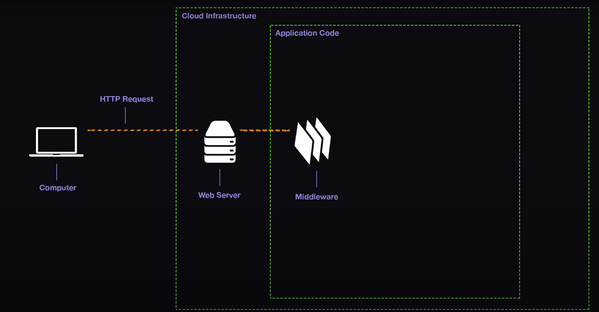

---

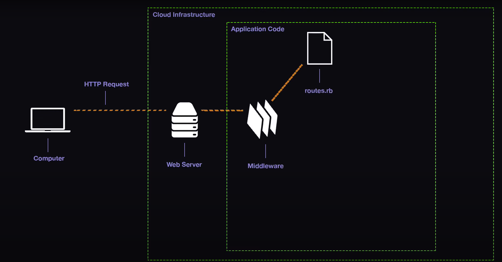

---

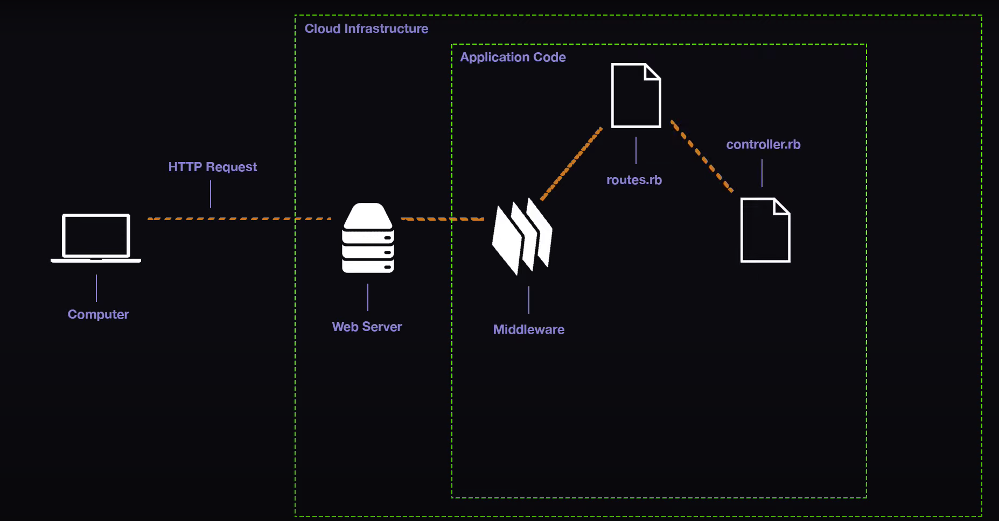

---

---

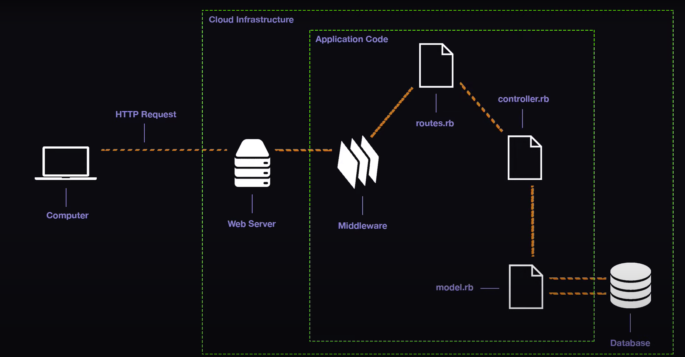

---

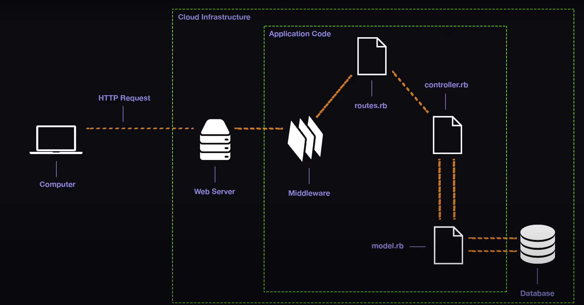

---

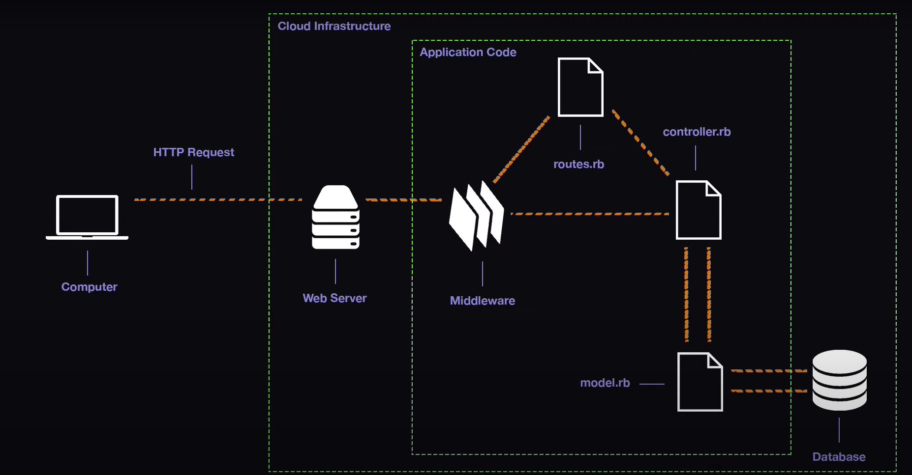

---

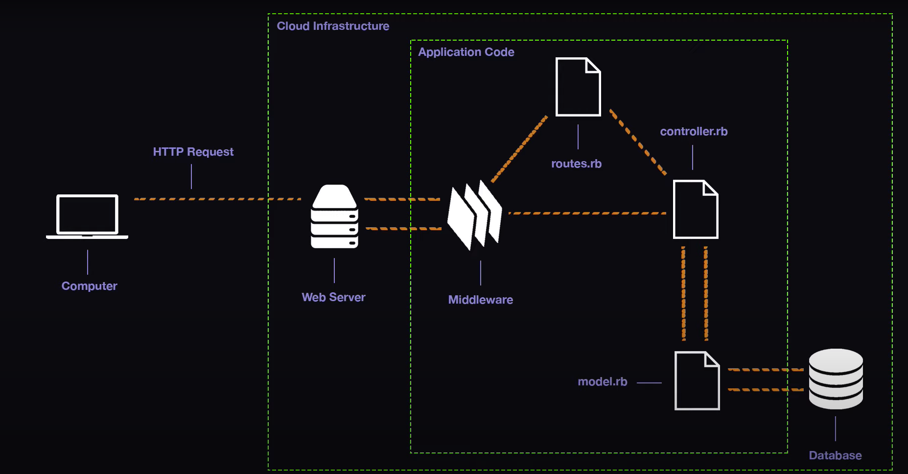

---

---

# Synchronous Request-Response Cycle

 

Long running request can end up blocking other server actions

creating a very slow user experience and in requests longer than 30 seconds

can even cause a request timeout error 😨

---

# Redis and Sidekiq to the Rescue!
 
 
 

---

# Redis

Redis is a simple data store that can be used as a database to store key/value pairs

It will act as our queue and store a list of long running processes as they come in

    Run locally using `redis-server`

---

# Sidekiq

This is our worker

 

It can handle processing many jobs (short and long running) to take the load off the main thread/server

Our worker is not limited to the same 30 second response timeout as our web server

It can take as long as it wants to complete its tasks

    Run locally using `bundle exec sidekiq`

---

# So how does it work???

---

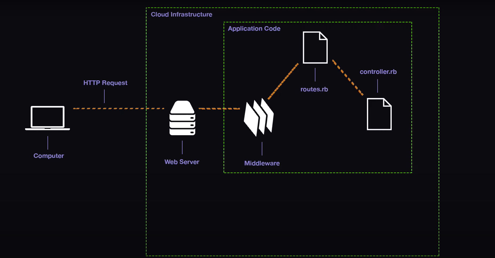

---

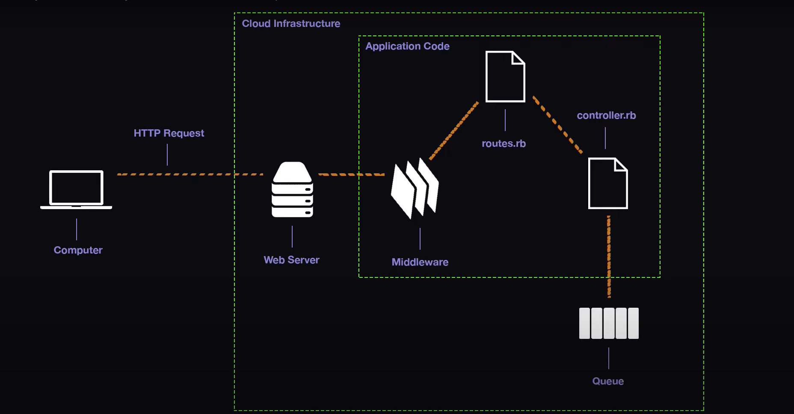

---

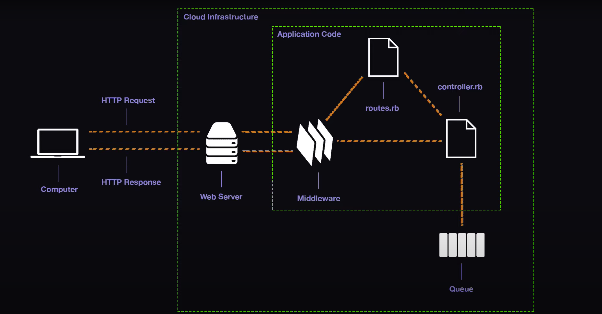

---

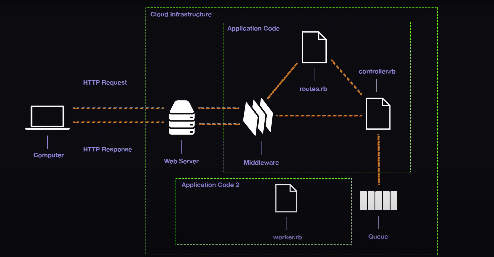

---

---

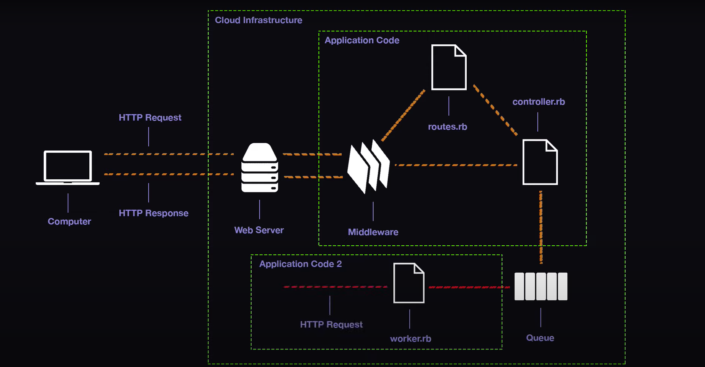

---